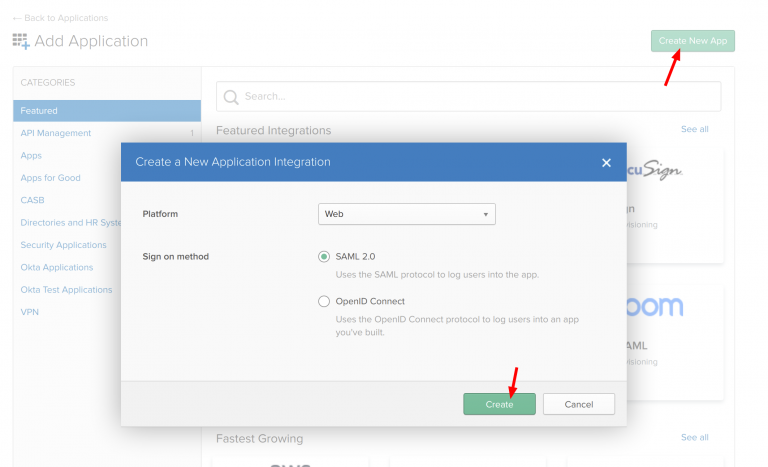
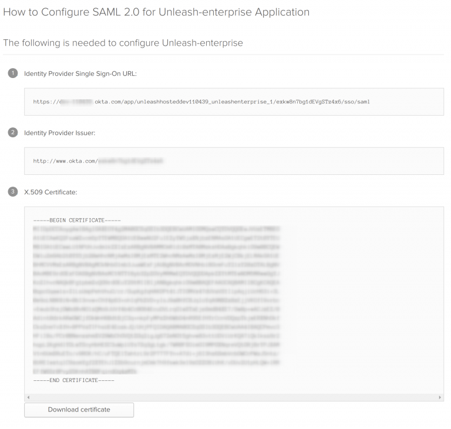
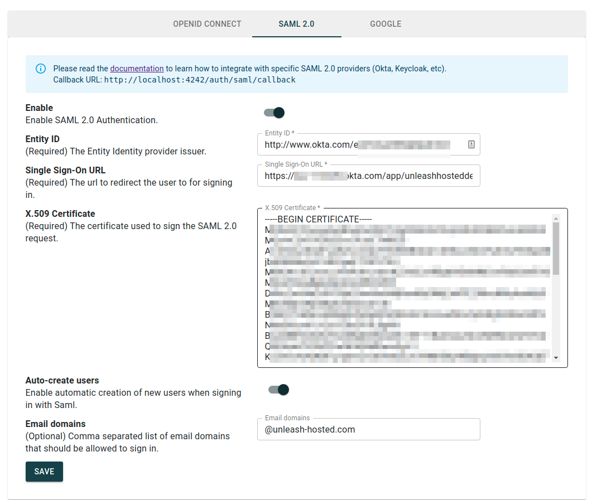
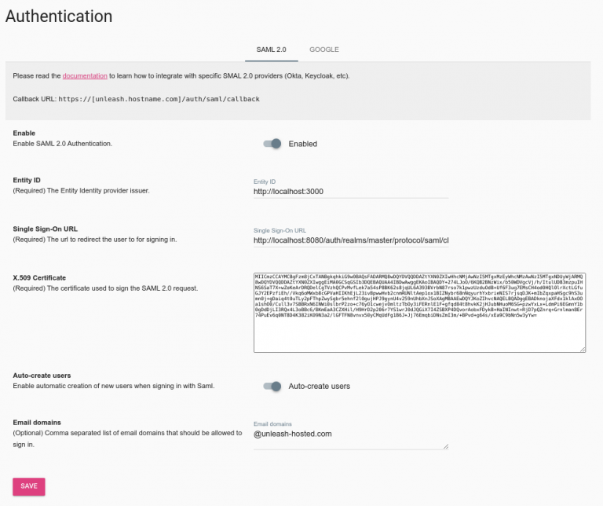
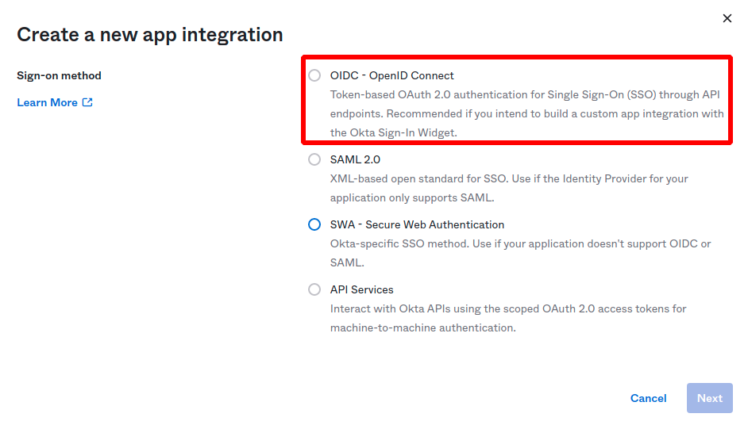
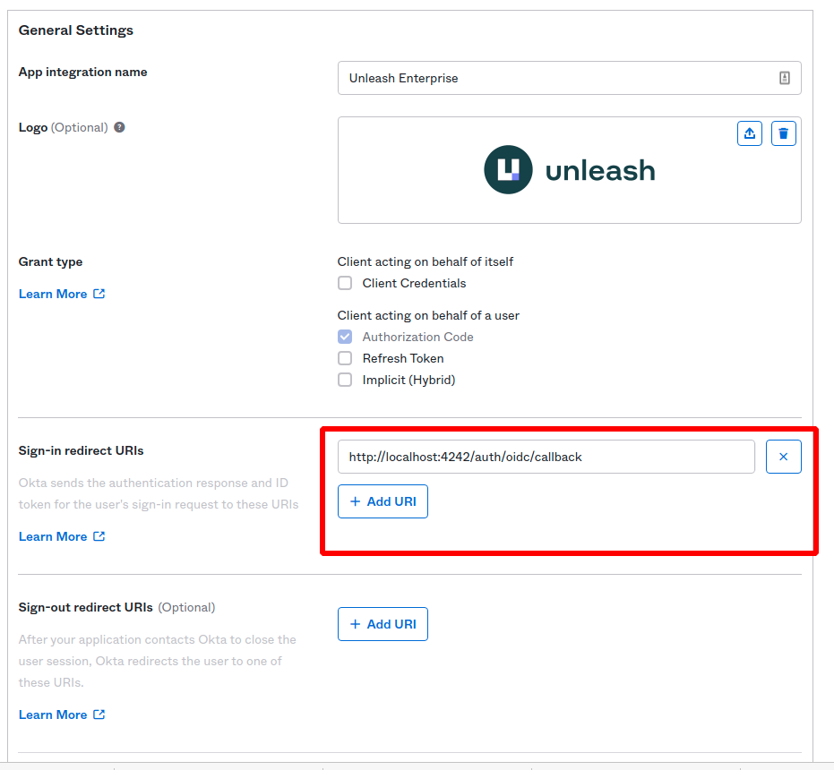
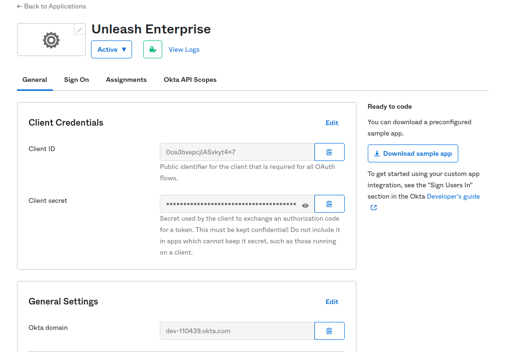
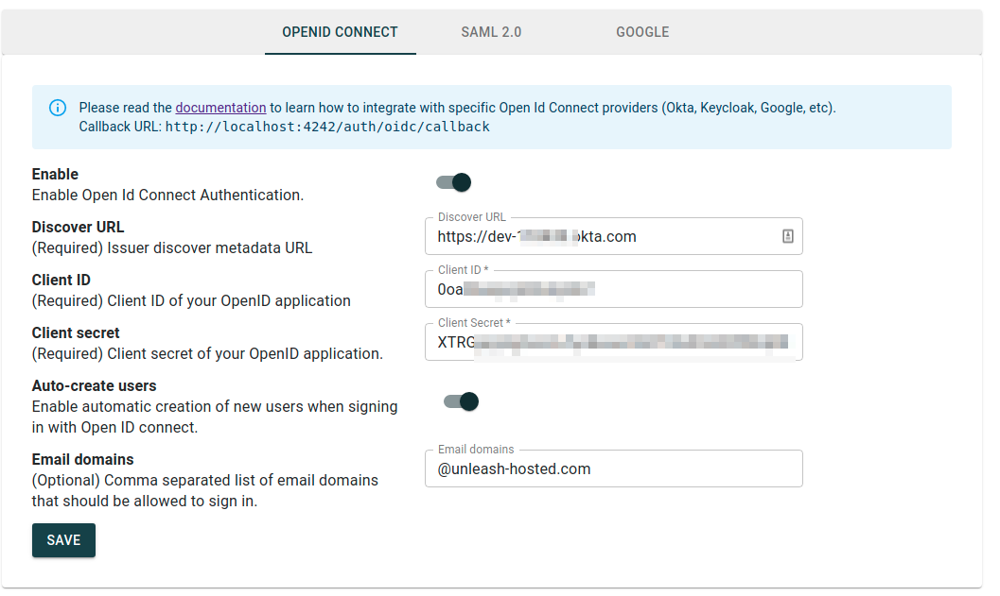
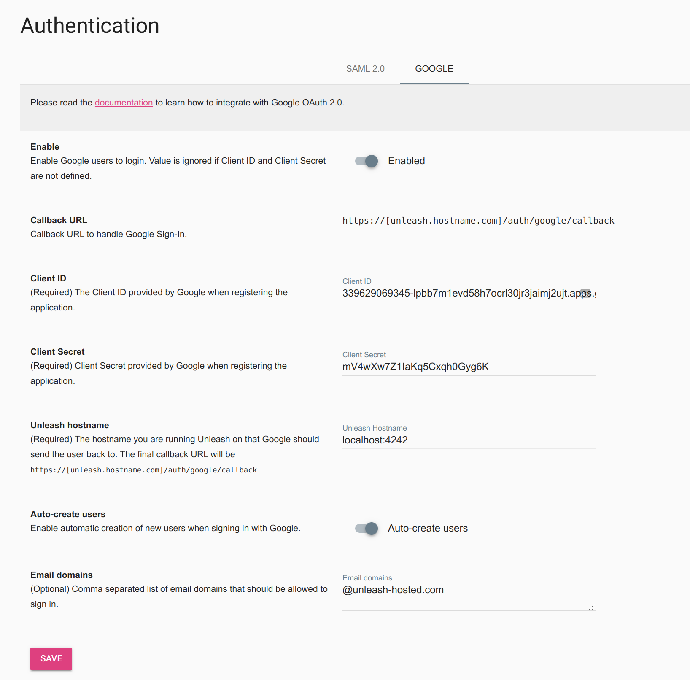
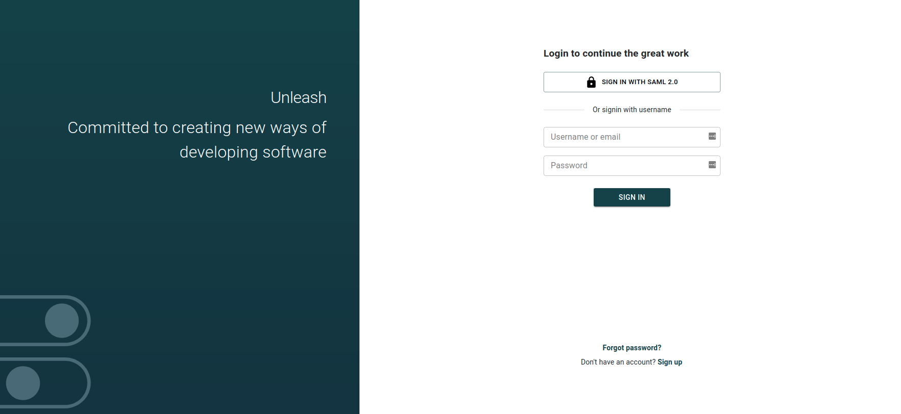

> This guide only applies to customers on the Enterprise subscription. Check out the [Unleash subscription plans](https://www.getunleash.io/plans) for details.

## Introduction

In this guide we will do a deep dive on the Single-Sign-On (SSO) integrations. Unleash Enterprise supports SAML 2.0, OpenID Connect and Google Authentication. In addition, Unleash Enterprise also supports username/password authentication out of the box, as you get with all the other versions of Unleash.

## Step 1: Sign-in

In order to configure SSO Authentication you will need to log in to the Unleash instance with a user that have "Admin" role. If you are self-hosting Unleash then a default user will be automatically created the first time you start unleash:

- username: `admin`
- password: `unleash4all` (or `admin` if you started with Unleash v3).

## Step 2: Configure Authentication provider

Unleash enterprise supports multiple authentication providers, and we provide in depth guides for each of them. To find them navigate to "Admin" => "Authentication" section.


## Step 3a: SAML 2.0

### Okta with SAML 2.0

If you are using Okta as your Authentication provider you start by signing in to your Okta account.

**Step 1: Create new Okta application**

Navigate to “Admin/Applications” and click the “Add Apps” button.


Then click “Create Application” and choose a new “SAML 2.0” application and click create



**Step 2: Configure SAML**

Unleash expect email to be sent from the SSO provider so make sure Name ID format is set to email. Also you must give the IDP Initiated SSO URL Name, we have chosen to call it “unleash-enterprise”. This gives us the Sign-on URL we will need in our Unleash configuration later.


> ### Important!
>
> Please make sure to replace URLs with the correct URL for your dedicated Unleash instance. This will require correct region prefix and the instance name. The example above uses region="us" and instance-name="ushosted".
>
> The correct format is: https://**[region]**.app.unleash-hosted.com/**[instanceName]**/auth/saml/callback

**Step 3: Get Setup Instructions**

Click the “view Setup Instructions” to get the necessary configuration required for Unleash.



**Step 4: Configure SAML 2.0 Authentication provider in Unleash**

Open Unleash Admin Dashboard and navigate to Admin -> Authentication -> SAML. Fill in the values captured in the “Get Setup Instructions” step.

You may also choose to “auto create users”. This will make Unleash automatically create new users on the fly first time they sign-in to Unleash with the given SSO provider. You may also limit the auto-creation to certain email domains, shown in the example below.



**Success!**

That should be it. Please note that you also must assign users to the application defined in Okta to actually be able to log-in to Unleash.

### Keycloak with SAML 2.0

**Step 1: Add client in Keycloak**

Open to the Keycloak dashboard and navigate to “Clients” and click “Add Client” button. Give it a unique clientId (e.g. unleash), use the “saml” protocol and specify the following SAML Endpoint:

```
https://<unleash.hostname.com>/auth/saml/callback
```


**Step 2: Change “Name ID format to “email”** Unleash expect email to be sent from the SSO provider so make sure Name ID format is set to email, see a). also you must give the IDP Initiated SSO URL Name, we have chosen to call it “unleash”, see 2). This gives us the Sign-on URL we will need in our Unleash configuration later.


**Step 3: Copy the Keycloak Entity ID an Signing key**

Navigate to “Realm Settings” and open the “SAML 2.0 Identity Provider Metadata”. You will need copy the entityID (a) and the X509Certificate (B). These will be required when configuring SAML 2.0 in Unleash.


**Step 4: Configure SAML 2.0 Authentication provider in Unleash**

Open Unleash Admin Dashboard and navigate to Admin -> Authentication. Fill in the values captured in the previous steps.

- Entity ID (3a)
- Single Sing-On URL (2b)
- Certificate (3b)

You may also choose to “auto create users”. This will make Unleash automatically create new users on the fly first time they sign-in to Unleash with the given SSO provider. You may also limit the auto-creation to certain email domains, shown in the example below.



## Step 3b: OpenID Connect

### Okta with OpenID Connect

If you are using Okta as your Authentication provider you start by signing in to your Okta account.

**Step 1: Create new Okta application**

Navigate to “Admin/Applications” and click the “Add Apps” button.


Then click “Create Application” and choose a new “OIDC - OpenID Connect” application, and choose application type "Web Application" and click create.



**Step 2: Configure Application Integration**

Give you application a name. And set the Sign-in redirect URI to:

`https://[unleash.hostname.some]/auth/oidc/callback`



Save your new application and your will ge the required details you need to configure the Unleash side of things:



**Step 3: Configure OpenID Connect provider in Unleash**

Navigate to Unleash and insert the details (Discover URL, Client Id and Client Secret) in to Unleash.



## Step 3c: Google Authentication

**Step 1: Setup Google OAuth 2.0 Credentials** Go to https://console.developers.google.com/apis/credentials

1. Click “Create credentials“
2. Choose “Oauth Client Id”
3. Choose Application Type: web application
4. Add https://[unleash.hostname.com]/auth/google/callback as an authorized redirect URI.

You will then get a Client ID and a Client Secret that you will need in the next step.


**Step 2: Configure Unleash**

Login to Unleash (admin/admin) and navigate to Admin -> Authentication -> Google.

First insert the Client Id and Client Secret from step 1.

You must also specify the hostname Unleash is running on. If Unleash is running on localhost you should specify the port as well (localhost:4242).

If you want to allow everyone to access Unleash, and have Unleash auto-create users you can enable this option. You should then also specify which email domains you want to allow logging in to Unleash.

Remember to click “Save” to store your settings.



## Step 4: Verify

Logout of Unleash and sign back in again. You should now be presented with the “SSO Authentication Option”. Click the button and follow the sign-in flow. If all goes well you should be successfully signed in to Unleash. If something is not working you can still sign-in with username and password.


