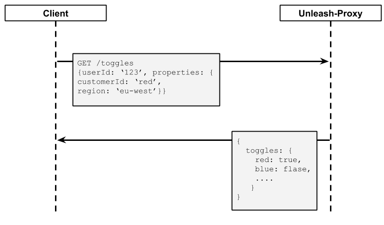

A lot of our users wanted to use feature toggles in their single-page and native applications. To solve this in a performant and privacy concerned way we built The Unleash Proxy

The Unleash Proxy sits between the Unleash API and the application. It provides a simple and super-fast API, as it has all the data it needs available in memory.

The proxy solves three important aspects:

- **Performance** – The proxy will cache all toggles in memory, and will be running on the edge, close to your end-users. A single instance will be able to handle thousands of request/sec, and you can scale it easily by adding additional instances.
- **Security** – The proxy evaluates the feature flags for the user on the server-side, and only exposes the results of enabled feature flags for a specific user.
- **Privacy** – If you run the proxy yourself (we can host it as well though) we will not see your end users. This means that you still have full control of your end-users, the way it should be!

*The Unleash-Proxy uses the Unleash SDK and exposes a simple API*. The Proxy will synchronize with the Unleash API in the background and provide a simple HTTP API for clients.

### Unleash Proxy API

The Unleash-Proxy has a very simple API. It takes the [Unleash Context](../user_guide/unleash_context) as input and will return the feature toggles relevant for that specific context. 

.

### We care about Privacy!
The Unleash Proxy is important because you should not expose your entire toggle configurations to your end users! Single page apps works in context of a specific user. The proxy will only return the evaluated toggles (with variants) that should be enabled for those specific users in that specific context.

Most of our customers prefer to run The Unleash Proxy themselves. PS! We actually prefer this as we don’t want to see your users. Running it is pretty simple, it is either a small Node.js process you start or a docker image you use. (We can of course host the proxy for you also.)

### How to connect to the Proxy?

The Unleash Proxy takes the heavy lifting of evaluating toggles and only returns enabled toggles and their values to the client. This means that you would get away with a simple http-client in many common use-cases.

However in some settings you would like a bit more logic around it to make it as fast as possible, and keep up to date with changes.

- [JavaScript Proxy SDK](./proxy-javascript)
- React SDK (coming soon)
- React Native SDK (coming soon)
- Android Proxy SDK (coming soon)
- iOS Proxy SDK (coming soon)

The proxy is also ideal fit for serverless functions such as AWS Lambda. In that scenario the proxy can run on a small container near the serverless function, preferably in the same VPC, giving the lambda extremely fast access to feature flags, at a predictable cost.

The unleash-proxy is compatible with unleash-enterprise and is offered as a free add-on to all our customers. We can also host it for you, for a small fee covering our cost.
